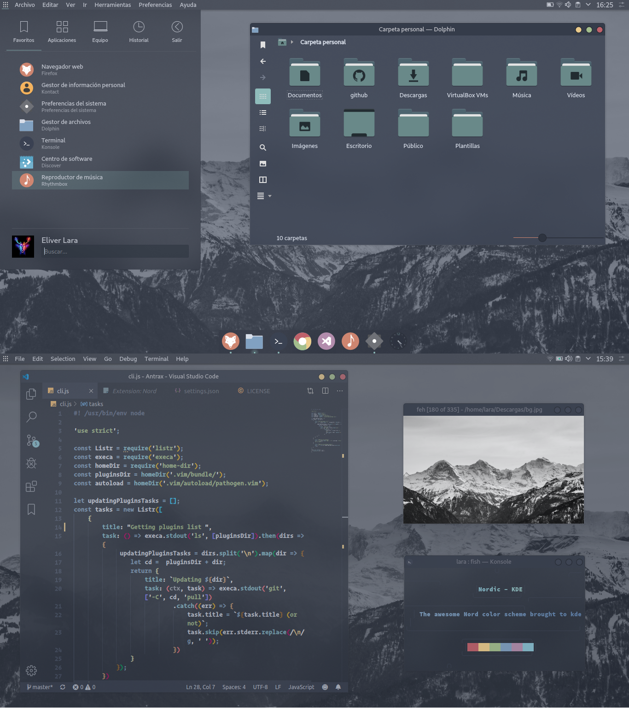
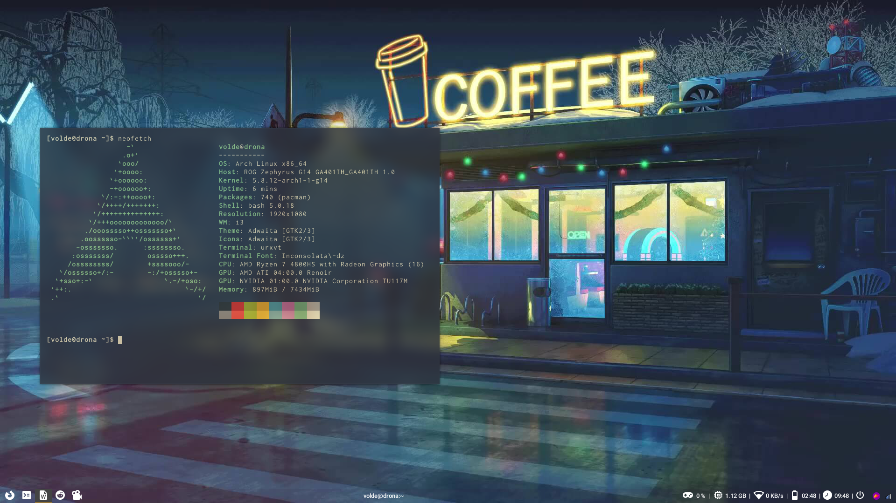

# References

1. [KDE Nordic](#KDE-Nordic)
2. [i3 Spooktober Blossoms](#i3-Spooktober-Blossoms)
3. [i3-gaps Cyberpunk Cafe Minimalism](#i3-gaps-Cyberpunk-Cafe-Minimalism)
4. [Bspwm Qubes OS](#Bspwm-Qubes-OS)
5. [KDE Inifinity Dark](#KDE-Inifinity-Dark)

## KDE Store
- [Layan -- Look & Feel Theme](https://store.kde.org/p/1325243)
- [Zafiro Icon -- Classic Icons](https://www.gnome-look.org/s/Gnome/p/1209330)
- [Nordic Folder Icon -- Classic Chill](https://www.gnome-look.org/p/1267246)

[KDE Nordic](https://www.reddit.com/r/unixporn/comments/d9okx3/kde_nordic_kde/)

  

[i3 Spooktober Blossoms](https://www.reddit.com/r/unixporn/comments/j3s3hv/i3_spooktober_blossoms/)

  

[i3-gaps Cyberpunk Cafe Minimalism](https://www.reddit.com/r/unixporn/comments/j3nzan/i3gaps_cyberpunk_cafe_minimalism_first_rice_ever/)

  

[Bspwm Qubes OS](https://www.reddit.com/r/unixporn/comments/j3zyyv/bspwm_qubes_os_my_daily_drive/)

  

[KDE Inifinity Dark](https://www.reddit.com/r/unixporn/comments/jfa4ct/plasma_5_new_dark_plasma_theme_infinityplasma/)

  

