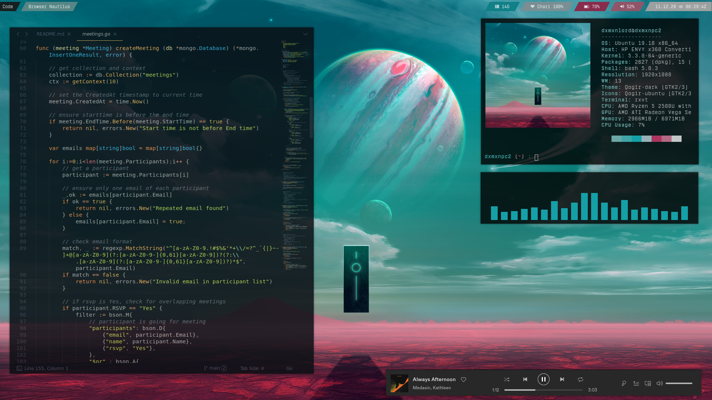

# References

- [i3-gaps Ubuntu](#i3-gaps-Ubuntu)
- [KDE Nordic](#KDE-Nordic)
- [KDE Inifinity Dark](#KDE-Inifinity-Dark)
- [Bspwm Qubes OS](#Bspwm-Qubes-OS)
- 

[i3-gaps Ubuntu](https://www.reddit.com/r/unixporn/comments/jsmth2/i3gaps_ubuntu_on_an_alien_planet/)

  

[KDE Nordic](https://www.reddit.com/r/unixporn/comments/d9okx3/kde_nordic_kde/)

  

[KDE Inifinity Dark](https://www.reddit.com/r/unixporn/comments/jfa4ct/plasma_5_new_dark_plasma_theme_infinityplasma/)

  

[Bspwm Qubes OS](https://www.reddit.com/r/unixporn/comments/j3zyyv/bspwm_qubes_os_my_daily_drive/)

  

